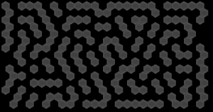
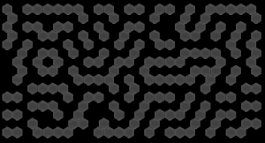

# Hexabyrinth

## Description

Hex tile based labyrinth generator.




## The algorithm

__Map generation__:

- Generate a layout where each _cell_ of the _map_ is randomly set to _on_ or _off_
- Update the world 10 times

__World update__:

- For each _cell_:
    - Count the _on_ _neighbours_ of the _cell_
    - If the _cell_ is _on_ and _number of neighbours_ is less than 1 or more than 2:
        - Set the _cell_ to _off_
    - Else if _number of neighbours_ is 2:
        - Set the _cell_ to _on_

## Requirements

- C++17 compatible compiler
- CMake

## Setting up

```
git clone https://github.com/snorrwe/hexabyrinth
cd hexabyrinth
git submodule init
git submodule update -r
cmake -H. -Bbuild
```

## Building

```
cmake --build build
```

## Running

Run the `hexabyrinth` executable in the `build` directory. Press `space` to generate a new labyrinth or `q` to quit.

